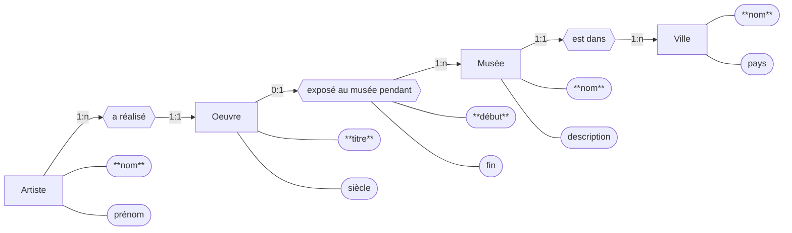

# Exercice 6 : Devoir maison noté
1. Représenter le schéma E/A de l'énoncé suivant. Une ville (nom, pays) a des musées (nom, description). Une œuvre (titre, siècle) est exposée dans un musée pendant
une certaine période (début, fin). Une œuvre peut ne pas être exposée. Elle peut aussz être exposée dans différents musées à différentes période. On connait le nom
et le prénom de l'artiste qui a réalisé une œuvre. Il y a un artiste par œuvre, les artistes réalisent de nombreuses œuvres. 
2. Album de musique 
- a. Représenter le schéma E/A de l'énoncé suivant. Un album (code, date), identifié par son code, est composé d'une série de plages. Les plages d'un album sont 
numérotées 1,2, ... ; Elles ont une durée. Un album contient au moins une plage. Chaque plage est l'enregistrement d'une seule œuvre, mais une œuvre peut s'étendre 
sur plusieurs plages (par exemple une symphonie en mouvements). Une œuvre a un identifiant et un titre. Certaines oeuvres ne sont pas enregistrées. On connaît les 
interprètes de l'oeuvre pour une plage donnée. Un interprète a un identifiant et un nom et peut jouer de nombreuses œuvres. Une œuvre peut être jouée par plusieurs 
interprètes. 
- b. On suppose que chaque interprète utilise exactement un instrument (piano, guitare, etc) sur une plage. Où placer l'attribut "instrument" dans le schéma 
précédent ? 
## 1 (schéma)
`(clé = "**clé**")`

## 2 (schéma)