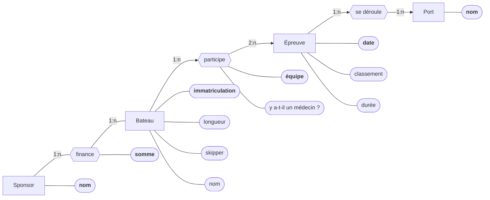

Exercice 5 : 
On considère une course nautique qui se déroule en plusieurs épreuves sanctionnées chacune par un classement des bateaux participants, chaque bateau participant à,
l'épreuve même s'il n'arrive pas au bout de l'épreuve (dernière position). Il y a une seule épreuve par jour, chaque épreuve débute et se termine dans un port, le
port pouvant être différent du port de départ. Chaque bateau a un numéro d'immatriculation, un nom et une longueur. Il a un skipper et un équipage et est financé par
un ou plusieurs sponsors. Le skipper d'un bateau ne peut pas changer d'une épreuve à l'autre de la course, en revanche la composition des équipiers d'un bateau peut
changer d'une épreuve à l'autre de la course. La base de données doit permettre de répondre, entre autres, aux questions suivantes :
- Quels sont les sponsors d'un bateau ?
- Quel est le montant de la subvention d'un sponsor particulier à un bateau particulier ?
- Quels bateaux sont engagés dans l'épreuve qui débute le 27 Avril ?
- Quels sont les équipiers du bateau qui a gagné la première épreuve ?
- Sur quels bateaux de plus de 12 mètres un équipier médecin est-il engagé ?
1. Proposez un schéma E/ A qui modélise la course nautique.
2. Dans votre schéma E/ A, est-ce qu 'un équipier peut être engagé sur plusieurs bateaux pendant la même épreuve ? Si oui, modifier le schéma E/ A afin de préciser
qu'un équipier ne peut pas être sur plusieurs bateaux pendant une épreuve.

`(les clés interne sont en gras et les clés externe en italique)`
